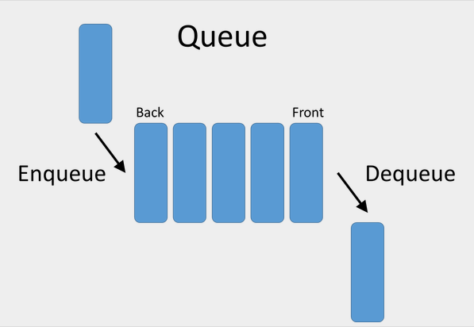

# Queues

A Queue is a linear data structure where data is stored in a **First In, First Out (FIFO)** manner. 

To better understand, here is a simple illustration: 



## Knowing the terms:
- **Enqueue**: This operation adds an item to the back of the queue. All items that will be added will always go to the back. 
- **Dequeue**: In contrast, this operation takes out the first item in the queue. 
- **Front**: The first item in the queue will be called the *front*. 
- **Back**: The last item in the queue will be called the *back*.  

## Analyzing Performance
Using Big O Notation, a queue's operations have solid performance. 

For instance, an enqueue does not require a shift of items in the queue since the new item will be added to the back. Therefore, the performance would be O(1). 

On the other hand, a dequeue requires to shift the items to the left since the first item will be removed. The front will be the following item before the previous item was removed. Therefore, the performance would depend on how many items are in queue, in other words O(n).

## Real-world Application
To better understand, imagine a line at a grocery store. The person in the front will be the first person to pay for their items and leave the line. When he leaves the line, the person behind will become the front. 

Similarly, a queue that would be used in software would be a printer in a public space like a library, for instance. When a request to print is made from a computer, the request is placed in a queue it will print according to the order of the queue. That way, the printer won't have trouble with multiple requests being pushed at the same time and pages do not get mixed up. 

## Example
In the example below, we will write a simple queue for a printer that can have unlimited requests in the queue. The framework for the queue is a class that has each of the operations: checking if the queue is empty, adding an item to the queue, removing an item from the queue, and returning the size of the queue. 

Returning the item when dequeing is important when there are additional operations in the code.

```python
class Queue:
    def __init__(self):
        self.items = []

    def is_empty(self):
        return self.items == []
    
    def enqueue(self, item):
        self.items.append(item)

    def dequeue(self):
        value = self.items.pop(0)
        return value

    def size(self):
        return len(self.items)

# Create an instance of a Queue
queue = Queue()

# Device Names of the computers that are making print requests
requests = [
    "Computer 1",
    "Computer 2",
    "Computer 3",
    "Computer 4",
    "Computer 5"
    ]

# Add the device names to the queue
for device in requests:
    queue.enqueue(device)

# Dequeue the first two device names in the queue
result = queue.dequeue()
print(result)

result = queue.dequeue()
print(result)

# Display the size of the queue
print(queue.size())

```
## Problem to Solve: Special Grocery Line
Write a program that will maintain a grocery line for shoppers that have 12 items or less. If the shopper has more than 12 items, they should not be added to the line. The line (queue) should be limited to 10 customers. Use the example above as a reference. The information for each customer will be stored in a dictionary as follows:

```python
shoppers = {
    "shopper 1": 4,
    "shopper 2": 7,
    "shopper 3": 8,
    "shopper 4": 14
}

```
You can check your code with the solution here: [Solution](python_files/queue.py)

[Back to Welcome Page](welcome.md)


