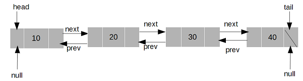

# Linked Lists

A Linked List is a useful data structure that connects pieces of data that are *not necessarily* next to each other in memory. 

## Nodes
A linked list is made up of elements that are called **nodes**. A node consists of the **value** it will hold as well as the **pointer** which points to the next node in the linked list. For instance, a node that holds a value of *3* will point to a node that has a value of *6*.

## Singly Linked Lists
A Linked List where the pointers point in one direction is known as a **singly linked list**.

To better understand, here is a simple illustration:


### Knowing the Terms:
- **Head**: The head is the first node of the linked list.
- **Tail**: The tail is the last node of the linked list. The pointer for this node will point to *null*.

## Doubly Linked Lists
Most linked lists are *bi-directional*, meaning that it functions in two directions. Instead of one, a node will have to pointers named **next** and **previous**: 

- **Next**: The next pointer will point to the next node. These pointers will be pointing to the right.
- **Previous**: The previous (referred to as *prev*) pointer will point to the previous node. These pointers will be pointing to the left.

To better understand, here is a simple illustration:



### Things to Note
Since the head will have two pointers, the prev will point to *null*. Both the head and tail will point to null.

## Inserting into a Linked List
There are three ways to insert a new node into a linked list: Inserting a new head, inserting a new tail, and inserting in between the head and the tail (or at the middle). Here are the processes for each one:

### Inserting at the head
1. Create a new node.
2. Set the "next" of the new node to the current head.
3. Set the "prev" of the current head to the new node.
4. Set the head equal to the new node.

The four steps can be implemented into four lines of code like so:

```python
new_node = Node(value)      # Step 1
new_node.next = self.head   # Step 2
self.head.prev = new_node   # Step 3
self.head = new_node        # Step 4
```

### Inserting at the Tail
1. Create a new node.
2. Set the "prev" of the new node to the current tail.
3. Set the "next" of the current tail to the new node.
4. Set the tail equal to the new node. 

The four steps can be implemented into four lines of code like so:

```python
new_node = Node(value)      # Step 1
new_node.prev = self.tail   # Step 2
self.tail.next = new_node   # Step 3
self.tail = new_node        # Step 4    
```

There is a **special case** that can occur when inserting the head or tail. If the linked list is empty, the only step is to assign the new node to the head *and* tail. You can check to see if the linked list is empty if the head is equal to None.

### Inserting in the Middle
When inserting somewhere in the middle of the linked list, we should know the node that we will be inserting after. This node will be called the current node. Knowing this, we can adjust the pointers of the current node and the following node to point to the new node that is being inserted. Here are the steps:

1. Create a new node.
2. Set the "prev" of the new node to the current node.
3. Set the "next" of the new node to the next node after current.
4. Set the "prev" of the "next" node after current to the new node.
5. Set the next of the current node to the new node.

These five steps can be implemented into five lines of code like so:

```python
new_node = Node(value)          # Step 1
new_node.prev = current         # Step 2
new_node.next = current.next    # Step 3
current.next.prev = new_node    # Step 4
current.next = new_node         # Step 5
```

## Removing from a Linked List
Removing the head or tail from a linked list is similar to inserting in moving the pointers yet it involves setting the current node to **None**.

### Removing the Head
1. Set the "prev" of the second Node to None.
2. Set the head to be the following node.

### Removing the Tail
1. Set the "next" of the second to last node to None.
2. Set the tail to be the second to last node.

### Removing in the Middle
Simply put, removing a node somewhere in the middle of the linked linst involves the rewiring of pointers from the previous node (current.prev) and the following node (current.next) of the node that will be removed. Here are the steps:

1. Set the prev of the node after current to the node before current.
2. Set the next of the node before current to the node after current.

## Evaluating Performance
In terms of Big O, a linked list's performance is more efficient in comparison to a dynamic array. 

### Inserts
Inserting a new node to the front of a linked list will not require a shift of data. With the concept of pointers, the performance of this operation is concluded as O(1). Meanwhile, inserting data in the front of a dynamic array will require a shift of data to the left; therefore, having a performance of O(n).

Inserting a new node at the end will produce a performance of O(1) for both linked list and dynamic array. 

Inserting a new node in the middle will require a search for the node that we will be inserting after. Because of this search, the performance is evaluated as O(n). Similarly, inserting in the middle of a dynamic array will have the same performance. 

### Removes
Removing a node in the front (or the head) will only require to change the value that the pointers point to. The performance of doing so will be O(1). On the other hand, a dynamic array needs to shift items in the list when there is an item other than the last one being removed. Therefore, the performance is O(n).

Removing a data point in the middle of both linked list and dynamic array will result in the same performance in O(n).

Lastly, removing the last item in both lists result in efficient performance in O(1).

With this information, we can conclude that linked lists have efficient performance when inserting at either the beginning and the end.

## Example
Here is implementation of a linked list that inserts a new node at the beginning of the linked list. In addition, it will also implement removing the head from the list. If you need to refresh on the operations, please look at the section above.

```python
class LinkedList:

    class Node:
        """
        The Node is a class caontained in another class. Also called an inner class. This will be used to instantiate the nodes that will be contained in the linked list.
        """
        def __init__(self, data):
            self.data = data
            self.next = None
            self.prev = None
    
    def __init__(self):
        self.head = None
        self.tail = None 

    def insert_head(self, value):
        """
        Insert a new node at the front of the linked list.
        """
        # Create the new node
        new_node = LinkedList.Node(value)

        # If the list is empty, set both the head and tail to equal the new node
        if self.head is None:
            self.head = new_node
            self.tail = new_node

        # Else, replace the current head with the new node
        else:
            self.head.prev = new_node
            new_node.next = self.head
            self.head = new_node

    def remove_head(self):
        """
        Remove the current head of the linked list.
        """
        self.head.next.prev = None
        self.head = self.head.next
```

## Problem To Solve: Inserting in the Middle
With the following implementation, do your best to add code for a new node to be inserted in the middle of the linked list. Remember, when inserting in the middle of the list, it needs to know what node it will be inserting after. Here is the code:

```python
def insert_after(self, value, new_value):
    """
    This function inserts a new node after the node that has value (parameter).
    """
    current = self.head
    while current is not None:
        if current.data == value:
            if current == self.tail:
                new_node = LinkedList.Node(new_value)
                # Add code when the node to insert after is the tail
            
            # If the node with value is not the tail, continue here
            else:
                new_node = LinkedList.Node(new_value)
                # Add code here

            return  # Exit the function after successful insertion
        current = current.next  # Continue the search until the node data matches the value
```


