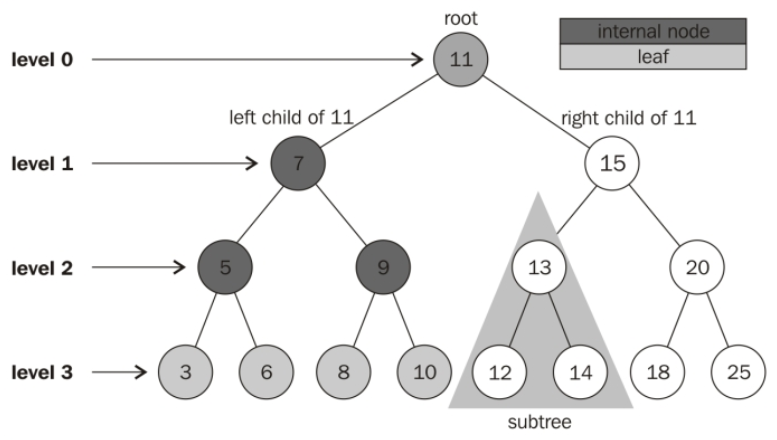
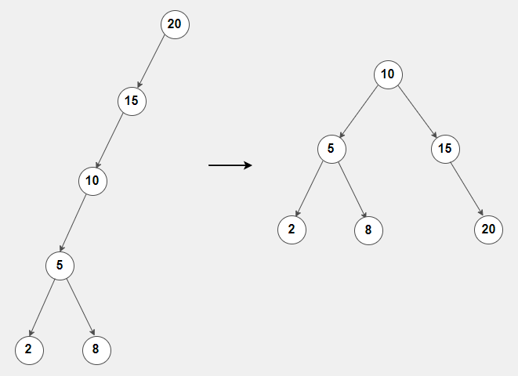

# Trees

A tree is similar to a linked list in that each node points to the next node. The difference is that a node can point to more than one node. The following tree types will be discussed:
- Binary Trees
- Binary Search Trees
- Balanced Binary Search Trees

## Binary Trees


A Binary Tree is a tree data structure that consists of nodes with a parent-child relationship. The top node of a tree is called the **root**. Each node following the root has a parent and zero or more children. A node that does not have any children are called **external nodes** or **leafs**.

**Subtrees** are common terminology as well. A subtree is any node in the tree and its descendants. The node with the value of 13 is a subtree with descendants 12 and 14.

A node can have **ancestors** or **descendants**. For instance, an ancestor of a node can be its parent, grandparent, great-grandparent, and so on. Similarly, a descendant of a node can be its child, grandchild, great-grandchild, and so on. For example, looking at the binary tree above 13 is the child of 15 *and* the grandchild of 11. In other words, 11 and 15 are the ancestors of 11.

## Binary Search Trees


A **Binary Search Tree** (BST) follows a process to organize nodes. Data is placed into the tree by comparing the data with the value in the parent node. If the data being added is less than the parent node, then it is placed in the left subtree. If the data being added is greater than the parent node, then it is placed in the right subtree. 

In the example above, the process of inserting 3 is as follows:
1. Start at the root and compare the values. Since 3 is smaller than 5, 3 will be placed in the left subtree.
2. Compare 3 with the following node which is 2. Since 3 is greater than 2, 3 will be placed to the right.
3. Lastly, compare 3 to the following node, 4. 4 is greater than 3; therefore, 3 will be placed to the left. Since 4 does not have any children, the seach stops and 3 will be added to the list.

**Activity**: Find the correct spot to put a node with the value of **8**.

## Balanced Binary Search Trees


A **Balanced Binary Search Tree** (Balanced BST) is a BST where the *height* between any two subtrees is not dramatically different. The **height** of a tree is the longest downward path from its root to any reachable leaf. For instance, the image above illustrates an **unbalanced** BST on the left, while the **balanced** BST is on the right. For the unbalanced BST, the *height*, or the longest path, from the root node to the furthest leaf is 5. On the other hand, the balanced BST has a height of 2. 

The height between the root node and any of the leafs in the balanced BST is the same, being 2. On the other hand, the height between the left and right subtree of the unbalanced binary tree is completely different with the height of the right subtree being 0. In order to balance the tree, there are many different algorithms you can implement. Examples of algorithims include *[red-black trees](https://www.topcoder.com/thrive/articles/An%20Introduction%20to%20Binary%20Search%20and%20Red-Black%20Trees)* and *[Adelson-Velsii and Landis](https://www.tutorialspoint.com/data_structures_algorithms/avl_tree_algorithm.htm)* (AVL) trees.

## Recursion
**Recursion** is a technique where a function calls iself. For example, consider the following code:

```python
def factorial(x):
    """
    This is a recursive function to find 
    the factorial of an integer.
    """
    if x == 1:      # Base Case 
        return 1
    else:           # Smaller Problem
        return (x * factorial(x - 1))

num = 3
print(f"The factorial of {num} is {factorial(num)}.")
# The factorial of 3 is 6
```
There are two important rules to follow when using recursion:

- **Smaller Problem**: When calling a function recursively, we need to pass a smaller problem to the function.
- **Base Case**: As the problem gets smaller and smaller, there needs to be a place to stop. We must define a scenario in which recursion is not required. When this condition is met, recursion will cease. 

According to the example above, the *smaller problem* is the argument we are passing to each recursive call (x - 1). The parameter is getting smaller each call by 1. Once the parameter meets the if condition, or the *base case*, it will return 1 and the recursion will stop. 

Without these two rules, a function will call itself forever or will stop with a **RecursionError**. 

## BST Operations
Most operations include recursion with increasing complexity. We will be looking at **inserting** and **traversing** through a tree.

### Inserting into a BST
Inserting into a BST is a recursive operation:

- Smaller Probem: Insert a value into the left subtree or the right subtree based on its value.
- Base Case: If the subtree is empty, then insert the node at the empty space.

The *Node* pf a tree is similar to that of a linked list, but the pointers will be renamed to the **left** and **right**.
The implementation there will be two insert functions: *insert* and *_insert*. The former will be the function that the user will call, while the latter will be the function that will be called recursively.

- insert: This function will hold a condition to check if the root of the tree is empty (or None). If it is not empty, it will call the *_insert* function and will pass the root.

- _insert: This function will slowly go down the tree to look for a spot to insert the new node. It will first compare the value of the new node with the value of the current node. If the value of the new node is less than the current node, the new node belongs on the left side of the tree/subtree. If the current node has an empty *left* space available, insert the new node. If that space is not available, we need to keep looking. This is when we recursively call *_insert*. This process is identical for nodes with a value higher than the current node.

```python
def insert(self, data):
    """
    This insert will be called by the user. 
    This initiates the insertion process of 
    'data' into the BST. If the BST is empty, 
    then set the root equal to the new node. 
    Otherwise, use _insert to recursively 
    find the location to insert.
    """
    if self.root is None:
        self.root = BST.Node(data)
    else:
        self._insert(data, self.root)

def _insert(self, data, node):
    """
    This function will look for a place to insert 
    a node with 'data' inside of it.
    
    Parameters:
        self (BST): An instance of BST.
        data: The data that will be inserted in the tree.
        node: The current subtree that is being searched.
    """
    # If the data is greater than the current node's data...
    if data < node.data:
        # The data belongs on the left side.
        if node.left is None:
            # We found an empty spot.
            # Create a new node and insert it
            # at that spot.
            node.left = BST.Node(data)
        else:
            # Otherwise, keep searching. Call _insert 
            # recursively on the left subtree.
            self._insert(data, node.left)

    elif data >= node.data:
        # The data belongs on the right side.
        if node.right is None:
            # We found an empty spot.
            # Create a new node and insert it
            # at that spot.
            node.right = BST.Node(data)
        else:
            # Otherwise, keep searching. Call _insert
            # recursively on the right subtree.
            self._insert(data, node.right)
```

## Traversing a BST
Traversing is a process of visiting all nodes in a tree. If we want to display all the data in the tree, we *traverse* through the list. Similar to insertion, traversing is a recursive process:
- Smaller Problem: Traverse the left subtree of a node, use the current node, then traverse the right subtree. 
- Base Case: If the subtree is empty, then don't recursively traverse or use anything.

```python
def __iter__(self):
    """
    Perform a forward traversal starting from the root of the BST. 
    """
    yield from self._traverse_forward(self.root)    # Start at the root

def _traverse_forward(self, node):
    """
    Does an in-order traversal through the BST. If the node we are given exists, then keep traversing on the left side. Then, provide the data in the current node, and finally we will traverse on the right side. 
    """
    if node is not None:
        yield from self._traverse_forward(node.left)
        yield node.data
        yield from self._traverse_forward(node.right)
```

### Things to note
The **__iter__** function is a special function. The double underscores in Python means that this function is part of the Python framework. If code such as **for item in collection** is implemented, the __iter__ function will be called. This is also called a *generator function*. 

"The **yield** statement suspends function's execution and sends a value back to the caller, but retains enough state to enable the function to resume where it is left off" ([source](https://www.geeksforgeeks.org/use-yield-keyword-instead-return-keyword-python/)). 

If we want to use the yield operation on another function, the command is modified to be **yield from**. 

## Evaluating Performance
We will be looking at the performance of the two operations above.

The process of *inserting* a new value into a BST involves comparing the value of the current node with the new value, and recursively calling the function with a progressively smaller subtree until an empty spot is found. Therefore, a BST is getting cut in half for every recursive call which makes the search smaller each time. The performance of inserting is evaluated as **O(log n)**.

However, *traversing* through a BST is not as efficient as inserting. Depending on the size of the BST, the operation's performance is evaluated as **O(n)**.

## Problem To Solve: Finding the Value
This problem will involve searching through the BST to see if it *contains* a value. If the value exists in the BST, the function will return **True**. Otherwise, it will return **False**.

With the following implementation, do your best to add code which will meet the requirements above. **Hint**: Determining if a value exists in the tree involves recursively searching its subtrees to find the value.

```python
def __contains__(value):
    """
    This function will be called by the user which initiates
    a search to find a value in the BST. The value that will
    be passed is the value that the user is trying to find.
    If the BST is empty, return False. Otherwise, call the 
    _contains function and start at the root. This function
    supports the ability to use the 'in' keyword:

    if 5 in my_bst:
        ("5 is in the bst")
    """
    # Write Conditions HERE
    if:
        return False
    else:
        pass

def _contains(value, node):
    """
    This recursive function will be called until the value is
    found. If the function does not find the function, it will
    return False. The node parameter represents the subtree 
    that will be searched. If the value is found in the BST,
    recursion should stop (Hint: Base Case). For every recursive
    call, the subtree should get smaller (Hint: Smaller Problem).
    """
    if node < node.data:
        # WRITE CODE HERE
        pass
    
    elif node > node.data:
        # WRITE CODE HERE
        pass

# Inserting values into the tree
tree = BST()
tree.insert(5)
tree.insert(3)
tree.insert(7) 
tree.insert(4)
tree.insert(10)
tree.insert(1)
tree.insert(6)

# Testing contain function
print(3 in tree) # True
print(2 in tree) # False
print(7 in tree) # True
```
You can check your code with the solution here: [Solution](python_files/tree.py)

[Back to Welcome Page](welcome.md)


